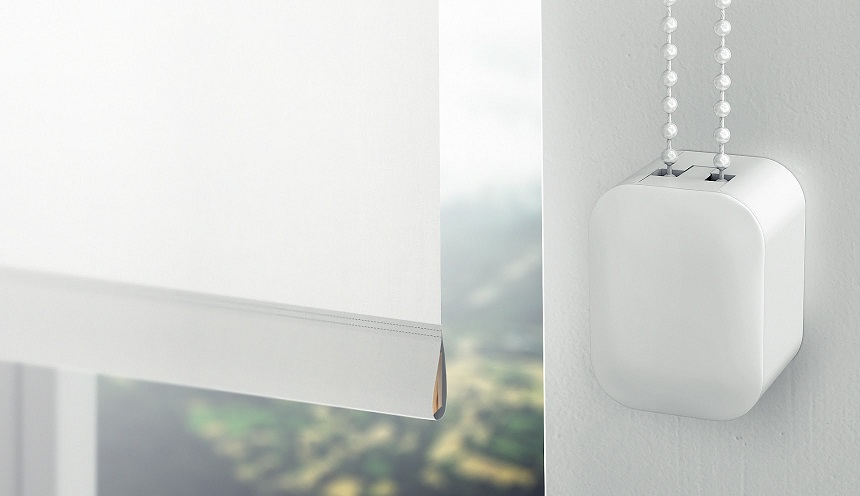
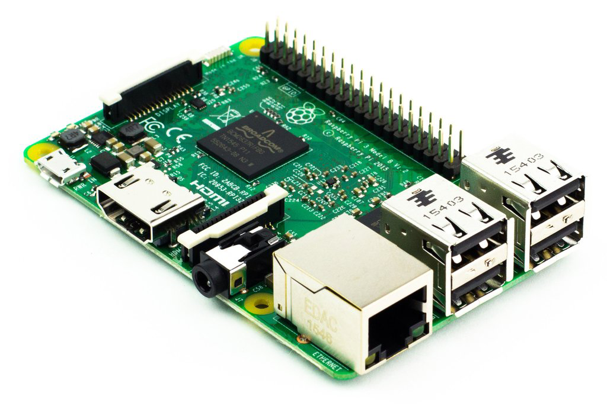

# How To Guide on controlling a <a rel="nofollow" href="https://www.amazon.co.uk/gp/product/B01E5O8P9O/ref=as_li_tl?ie=UTF8&camp=1634&creative=6738&creativeASIN=B01E5O8P9O&linkCode=as2&tag=httpgithcomsk-21">SOMA Smart Shade</a> with [Apple's Home.app](http://www.apple.com/uk/ios/home/) using [Homebridge](https://github.com/nfarina/homebridge) on a <a rel="nofollow" href="https://www.amazon.co.uk/gp/product/B01CI5879A/ref=as_li_tl?ie=UTF8&camp=1634&creative=6738&creativeASIN=B01CI5879A&linkCode=as2&tag=httpgithcomsk-21">Raspberry Pi 3 Model B</a>


---

# Items needed for this project:

* 1x iOS 10 device running [Apple's Home App](http://www.apple.com/uk/ios/home/)
* 1x Roller Blind (Example: <a rel="nofollow" href="https://www.amazon.co.uk/gp/product/B00XLE0O94/ref=as_li_tl?ie=UTF8&camp=1634&creative=6738&creativeASIN=B00XLE0O94&linkCode=as2&tag=httpgithcomsk-21">LINK</a>)
* 1x SOMA Smart Shade (you can buy them from: <a rel="nofollow" href="https://www.amazon.co.uk/gp/product/B01E5O8P9O/ref=as_li_tl?ie=UTF8&camp=1634&creative=6738&creativeASIN=B01E5O8P9O&linkCode=as2&tag=httpgithcomsk-21">LINK</a>)
* 1x Raspberry Pi 3 Model B (you can buy them from: <a rel="nofollow" href="https://www.amazon.co.uk/gp/product/B01CI5879A/ref=as_li_tl?ie=UTF8&camp=1634&creative=6738&creativeASIN=B01CI5879A&linkCode=as2&tag=httpgithcomsk-21">LINK</a>)

---

# Mount your Smart Shade.



#### Install and setup your Smart Shade into your desired location as normal using the [Smart Shades](https://itunes.apple.com/us/app/smart-shades/id1016406862?mt=8) app, a guide for doing this can be found here: https://youtu.be/9DTAcZiiFYU

---

# Setup Your Raspberry Pi & Install Homebridge.



#### Follow this step by step guide to install the HomeBridge service on your Raspberry PI which is used to connect/bridge your non-HomeKit accessories and make them HomeKit enabled

https://github.com/nfarina/homebridge/wiki/Running-HomeBridge-on-a-Raspberry-Pi

---

# Configuration.

#### Copy the files to the Raspberry Pi.

* Download and place the *control.py, blinddown.sh* & *blindup.sh* files in your /home/pi directory.

#### Find the Bluetooth MAC address of the Smart Shade.

You need to find the Bluetooth MAC address of the SOMA Smart Shade so your Raspberry Pi can communicate with it.

  * Enable your Bluetooth adaptor on the Raspberry Pi using the command:

        sudo hciconfig hci0 up

  * Now scan for your Smart Shade (it will normally be identified with the name RISExxx) using the command:

        sudo hcitool lescan

  * Make a note of the Smart Shades MAC address.


  * Open the *blinddown.sh* and *blindup.sh* files and edit the MAC address codes (00:00:00:00:00:00) so that they match the MAC code of the Smart Shade that you just found.

#### Configure Homebridge to create a switch to move the shades up and down.

  * Install the [Script2](https://github.com/pponce/homebridge-script2) homebridge plugin using the command:

        sudo npm install -g homebridge-script2

  * Configure the plugin to create a switch, on your Raspberry Pi go to your /home/pi/.homebridge folder and edit the *config.json* file


Add in the following code under the accessories section.

```
"accessories": [
{
  "accessory": "Script2",
  "name": "Blind",
  "on": "./blinddown.sh",
  "off": "./blindup.sh",
  "fileState": "./script.flag",
  "on_value" : "true"
}
]
```

---

# Finish

#### Now that everything is installed and configured you should be able to run Homebridge on your Raspberry Pi with the command:

    homebridge

#### And if you did everything correctly a new Blind accessory switch will show up in your Home.app on your iPhone or iPad

#### Turning the Switch OFF will raise your blind and turining it ON will lower it.

---

### Guide created by SkyJohn on March 25th 2017

---

# Changelog

### 1.0.0
* How To Guide created.
